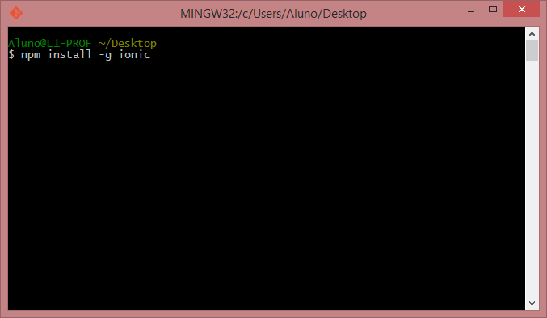
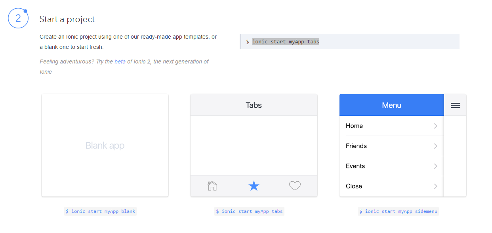
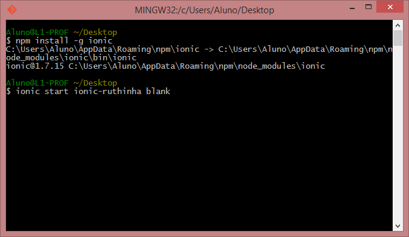
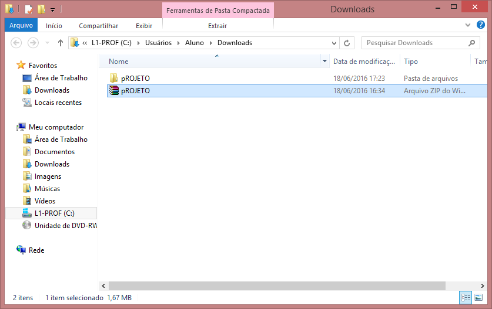

#primeiro passo

Fazer o layout no [ionic creator](https://creator.ionic.io) 

Fazer a instalação do [nodejs](https://nodejs.org/en/download/)

Fazer a instalação do ionic ```npm install -g ionic```. [link para a documentação](http://ionicframework.com/)


Inicializar projeto conforme documentação [Link para documentação](http://ionicframework.com/getting-started/)

Primeiro - Inicializar projeto, no nosso caso ``` ionic start ionic-ruthinha blank```


Escolhemos o tipo e inicializamos 



#segundo passo

Fazer o download do app criado no ionic creator

Descompactar o arquivo e copiar o conteúdo para a pasta ```www``` na raiz do projeto

